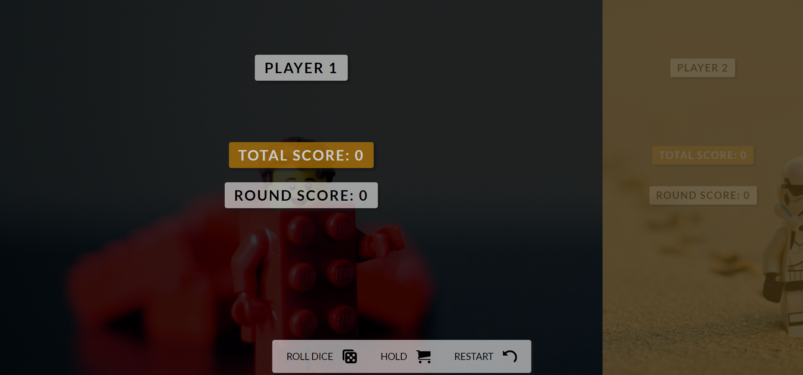

# Dice Game App

Website made in order to make me more familiar with JS and object oriented programming.
I made this app by combining the idea/rules for the game (taken from a online course that I took) with knowledge of object oriented programming that I gained from another course.

In order to see a demo visit [this link](https://tompod92.github.io/Dice-Game-2/)



---

## Rules of the game

- The game has 2 players, playing in rounds

- In each turn, a player rolls a dice as many times as he whishes. Each result gets added to his ROUND score

- BUT, if the player rolls a 1, all his ROUND score gets lost. After that, it's the next player's turn

- The player can choose to 'Hold', which means that his ROUND score gets added to his GLOBAL score. After that, it's the next player's turn

- The first player to reach 100 points on GLOBAL score wins the game

## In order to few the source code download/clone this repository

```bash
npm install
npm run start
```
